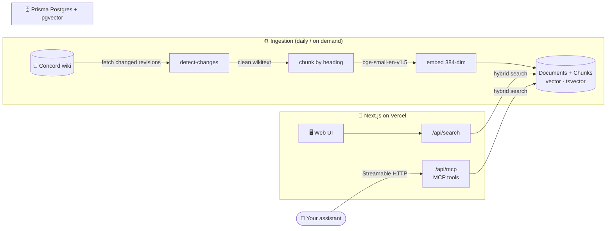

<div align="center">

# 🏰 Concord Knowledge

**Hybrid semantic + keyword search over the [Concord](https://wiki.concordlarp.com) LARP wiki, as a web app _and_ an MCP server.**

Ask about characters, rules, factions, politics, and lore, and get back short, cited excerpts that link straight back to the source page.

<br />


</div>

---

> [!NOTE]
> **Concord** is a fantasy weekender LARP in Perth, Western Australia, set in the world of **Esterra**. This repo is the search layer over its public wiki: it ingests each page, embeds it, and serves ranked excerpts to both a browser UI and any MCP-capable assistant. It is **excerpt-only and non-commercial**, every result deep-links to the canonical wiki page.

## ✨ What it does

- 🔎 **Hybrid retrieval.** Every query runs semantic vector search (pgvector) _and_ Postgres full-text search, then fuses the two rankings, so it catches both "what I meant" and "the exact word I typed".
- 🧩 **Section-aware chunks.** Pages are sliced along their headings, so a hit points you at the right section with a readable heading path, not a wall of text.
- 🏷️ **Faceted filtering.** Narrow by **realm**, **sphere**, **page type** (rules / lore / newsletter / history / war-report / fiction), or **season**.
- 🔌 **MCP server.** The same retrieval core is exposed over Streamable HTTP so you can wire the wiki into your own assistant.
- ♻️ **Incremental ingestion.** A daily job checks the wiki for changed revisions and only re-embeds what actually moved, so quiet days finish in seconds.
- 🔒 **Rate limited.** Per-IP limiting (Upstash Redis) guards both the search API and the MCP endpoint.

## 🧭 How it works



Semantic and keyword ranks are computed against the same section chunks, then fused, so a query like _"who runs the arcane council"_ finds the Shardcircle page even without the literal word "arcane".

## 🔌 MCP server

Point any MCP-capable client at **`/api/mcp`** (Streamable HTTP). Three tools are registered:

| Tool | What it returns |
| --- | --- |
| **`search_wiki`** | Hybrid semantic + keyword search. Optional `realm`, `sphere`, `pageType`, `season`, and `limit` filters. Returns cited excerpts with a `sourceUrl`. |
| **`get_page`** | One wiki page by exact title, as section-by-section excerpts. |
| **`list_facets`** | The available filter values (realms, spheres, page types, seasons) with document counts, to feed back into `search_wiki`. |

> [!TIP]
> Every tool returns short **cited excerpts plus a source URL**, never full page text. The full content always lives at the linked wiki page.

## 🧱 Tech stack

| Layer | Choice |
| --- | --- |
| **Framework** | Next.js 16 (App Router) · React 19 |
| **Language** | TypeScript 5 |
| **Styling** | Tailwind CSS 4 · shadcn/ui · Radix UI |
| **Database** | Prisma Postgres · Prisma 7 (`pgvector` + generated `tsvector`) |
| **Embeddings** | `@huggingface/transformers` running `Xenova/bge-small-en-v1.5` locally (ONNX, 384-dim) |
| **MCP** | `mcp-handler` over Streamable HTTP |
| **Rate limiting** | Upstash Redis + `@upstash/ratelimit` |
| **Ingestion runtime** | Bun |
| **Validation** | Zod 4 |
| **Testing** | Vitest · Testing Library · MSW |
| **Hosting** | Vercel + GitHub Actions (scheduled ingest) |

## 🚀 Getting started

> [!IMPORTANT]
> You need a Postgres database with the **`vector`** extension available (this project targets **Prisma Postgres**) and [Bun](https://bun.sh) installed for the ingestion CLI.

<details open>
<summary><b>1. Install & configure</b></summary>

```bash
bun install
cp .env.example .env   # then fill in the values below
```

</details>

<details>
<summary><b>2. Set up the database</b></summary>

```bash
bunx prisma generate         # generate the client (also runs on postinstall)
bunx prisma migrate deploy   # apply migrations, including the pgvector + tsvector setup
```

</details>

<details>
<summary><b>3. Ingest the corpus</b></summary>

```bash
bun run ingest   # fetch, clean, chunk, and embed the wiki into Postgres
```

The first run downloads the ~130MB embedding model once, then caches it. Subsequent runs only touch pages whose revision changed.

</details>

<details>
<summary><b>4. Run the app</b></summary>

```bash
bun run dev      # http://localhost:3000
```

The web UI lives at `/`, the search API at `/api/search`, and the MCP server at `/api/mcp`.

</details>

## 🔧 Environment

| Variable | Purpose |
| --- | --- |
| `DATABASE_URL` | Prisma Postgres connection string. The app and ingestion both read/write through it. |
| `CONCORD_WIKI_BASE_URL` | Canonical wiki source, used for ingestion and for attribution deep-links. |
| `UPSTASH_REDIS_REST_URL` | Upstash Redis endpoint for per-IP rate limiting. Leave blank in local dev to disable it. |
| `UPSTASH_REDIS_REST_TOKEN` | Auth token for the Upstash endpoint. |

## 📜 Scripts

| Command | Does |
| --- | --- |
| `bun run dev` | Start the Next.js dev server. |
| `bun run build` | Generate the Prisma client, then build for production. |
| `bun run start` | Serve the production build. |
| `bun run ingest` | Run the incremental ingestion pipeline. |
| `bun run lint` | ESLint. |
| `bun run typecheck` | `tsc --noEmit`. |
| `bun run test` | Vitest (one-shot). `test:watch` for watch mode. |

## 🗂️ Project structure

```text
src/
├── app/                 Next.js App Router: web UI + routes
│   └── api/
│       ├── search/      Web search endpoint
│       └── [transport]/ MCP server (/api/mcp)
├── ingest/              Fetch → detect-changes → clean → chunk → embed → upsert
├── retrieval/           Hybrid search, embeddings, facets, page/excerpt shaping
├── db/                  Prisma client wiring
├── components/ui/       shadcn/ui components
└── config/, lib/        Display config, rate limiting, shared utils
prisma/                  schema + migrations (pgvector, generated tsvector, HNSW index)
.github/workflows/       ingest.yml — daily corpus refresh
```

## 🔄 Keeping the corpus fresh

The **[`Ingest wiki`](.github/workflows/ingest.yml)** GitHub Action runs daily at **15:37 UTC** (and on demand via _workflow dispatch_). It checks the wiki for changed revisions first and short-circuits when nothing moved, so idle days never load the model or fetch page content.

## ⚖️ Attribution & posture

> [!CAUTION]
> This project indexes the public Concord wiki for **non-commercial, excerpt-only** search. Results are short cited snippets that link back to the canonical page, they are **not** a republished copy of the wiki. The full content belongs to, and lives at, [wiki.concordlarp.com](https://wiki.concordlarp.com).

<div align="center">
<sub>Built for the world of <b>Esterra</b> · an empire of necessity ⚔️</sub>
</div>
